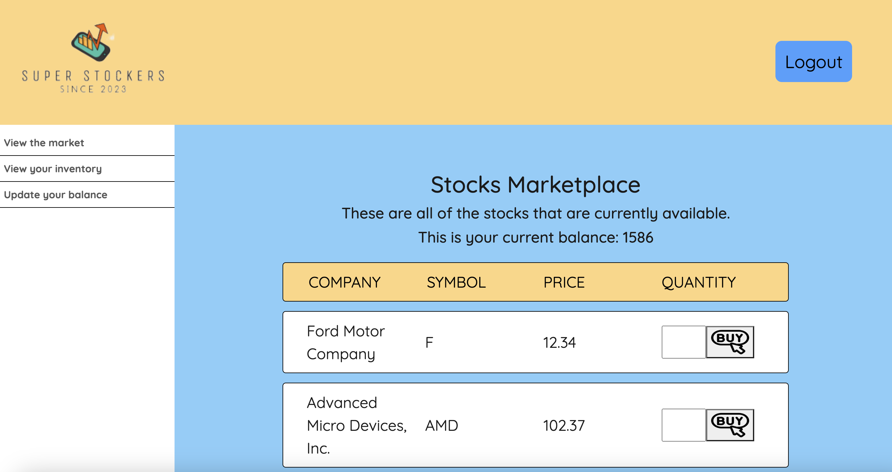

<!-- PROJECT LOGO -->
<br />
<div align="center">
  <a href="#about-the-project">
    
  </a>

  <h3 align="center">Stock Trader</h3>

</div>

<!-- ABOUT THE PROJECT -->
## About The Project



This application allows a user to view, buy and sell stocks within the marketplace. 

### Built With

* Bcrypt
* Sequelize
* Express
* Express-Handlebars
* Express-Session
* MySQL
* Sweet Alert
* Bootstrap
<!-- GETTING STARTED -->
## Getting Started

Please follow the instructions below to run this application locally.

### Installation

1. Clone the repo
   ```sh
   git clone https://github.com/your_username_/Project-Name.git
   ```
2. Install NPM packages
   ```sh
   npm install
   ```
4. Create a database in MySQL `stocks_db`

5. Enter your credentials for MySQL in `.env` file
  ```
DB_NAME='stocks_db'
DB_PASSWORD='ENTER PASSWORD'
DB_USER='ENTER USER'
   ```
6. Seed the database by entering `npm run seed` in the command line.

7. Start the application by entering 'node server.js' or 'npm start' in the terminal.


<!-- USAGE EXAMPLES -->
## Usage

[Walkthrough Video of the Stock Trader](https://drive.google.com/file/d/1pvwjUdMs_kGIV5LflQDhBdkNioV8RdRg/view)

<!-- CONTRIBUTING -->
## Contributing

We are currently not taking any contributions.


<!-- LICENSE -->
## License

Distributed under the MIT License. See `LICENSE.txt` for more information.

<!-- CONTACT -->
## Contact

Katherine Thames - [kthames](https://github.com/kthames) - k.thames@me.com

Francis Yang - [fy50167](https://github.com/fy50167) - fy50167@gmail.com

Project Link: [GitHub](https://github.com/Fy50167/stock-trader)

Deployed Link: [Heroku](https://limitless-lake-22682-94d9006e293e.herokuapp.com/)


